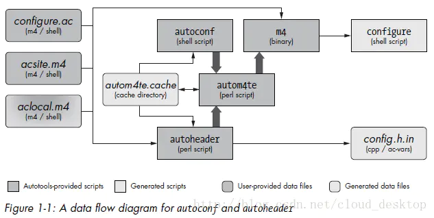
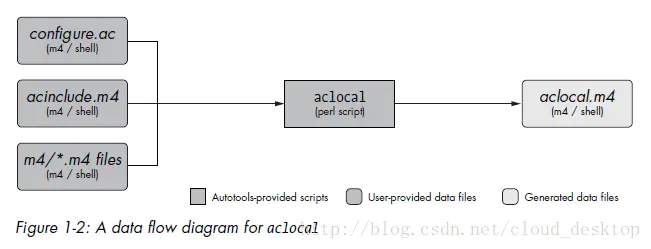
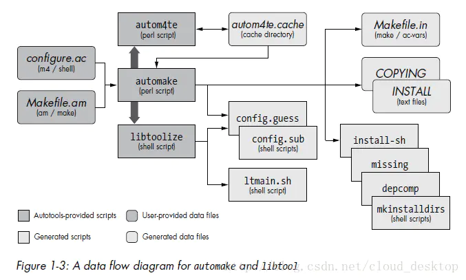
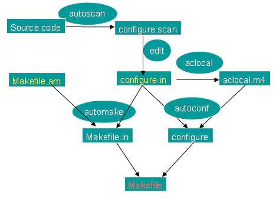
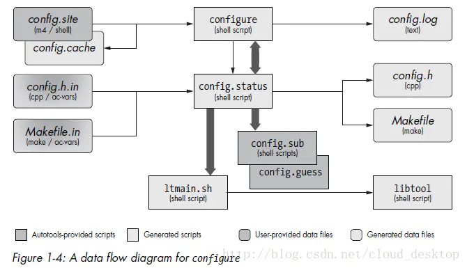

# GNU autotools

## 概述

### 

autoscan: 扫描源代码以搜寻普通的可移植性问题，比如检查编译器，库，头文件等，生成文件configure.scan,它是configure.ac的一个雏形。

aclocal:根据已经安装的宏，用户定义宏和acinclude.m4文件中的宏将configure.ac文件所需要的宏集中定义到文件 aclocal.m4中。aclocal是一个perl 脚本程序，它的定义是：“aclocal - create aclocal.m4 by scanning configure.ac”

automake:将Makefile.am中定义的结构建立Makefile.in，然后configure脚本将生成的Makefile.in文件转换 为Makefile。如果在configure.ac中定义了一些特殊的宏，比如AC_PROG_LIBTOOL，它会调用libtoolize，否则它 会自己产生config.guess和config.sub

autoconf:将configure.ac中的宏展开，生成configure脚本。这个过程可能要用到aclocal.m4中定义的宏。

## autotools概述

在GNU归档中找不到autotools软件包，实际上它是指三个GNU包： autoconf、automake和libtools。将三者配合使用，可以产生可移植的软件。

#### autoconf

autoconf 是一个可扩展的M4宏集合。用于产生shell脚本，为工程的源代码自动产生配置脚本。这些脚本能自动适配多种类的Unix操作系统。

autoconf 包括的程序有：

- autoscan

一般在一个新工程中用autoscan扫描源代码，生成文件configure.scan。autoscan寻找可移植性问题，比如检查编译器、库、头文件等。

开发者可以在configure.scan的基础上修改，得到自己的configure.ac（或者configure.in）。

- autoheader

当configure.ac文件中引用了宏AC_CONFIG_HEADER()时，autoheader会根据configure.ac中的宏定义，产生C/C++兼容的头文件模板config.h.in。

当使用者执行脚本configure时，会根据config.h.in生成头文件config.h。所以软件源代码可以包含config.h，使用其中定义的变量等。

- autom4te (发音automate)

autom4te是M4的智能缓存包装器。其他autotools工具（如autoconf和automake），可以用它减少访问configure.ac的时间。

在运行autoconf或autoreconf之后，autom4te在工程的顶层目录中，生成autom4te.cache目录。

- autoconf

autoconf是个简单的shell脚本，它将configure.ac中的宏展开，生成configure脚本。这个过程用到aclocal.m4中定义的宏。

autoconf首先确保当前shell包含必要的功能，来执行M4宏处理器，然后解析命令行参数，并执行autom4te。



- autoreconf

autoreconf 基于configure.ac的内容，以正确的顺序依次执行autoconf、automake、和libtool软件包中的其他配置工具，生成configure脚本。

autoreconf足够聪明执行你需要的工具，以你需要它们的顺序，用你想要的选项。事实上，autoreconf是执行Autotools工具链的推荐方法。

- autoupdate

autoupdate升级configure.ac，以匹配当前版本的autotools所支持的语法。

- ifnames

ifnames程序是一个在通常情况下并未充分使用的小工具，它可以接受命令行中的源文件名列表，显示stdout设备上的C预处理器定义列表。这个工具被设计用于帮助维护者决定放入configure.ac和Makefile.am文件中的内容，以使得它们可移植。如果你的工程考虑写成某种程度上可移植，ifnames可以帮助你决定那些试图可移植的部分在你源码树中的位置，给出潜在的可移植定义的名字。

#### automake

automake扩展了autoconf，它将定义在Makefile.am中的项目构建规则，转换成Makefile。它创建的Makefile符合GNU编码标准定义的准则。

automake 包括的程序有：（以Perl脚本的形式提供）

- aclocal

aclocal的定义是：“aclocal - create aclocal.m4 by scanning configure.ac”。它根据configure.ac的需要，将系统已经安装的automake宏，和用户定义的宏（在文件acinclude.m4中，或在子目录m4中的.m4文件中），集中到文件 aclocal.m4中。



- automake

根据高层次的生成规范文件Makefile.am，生成标准makefile模板Makefile.in。以后脚本configure会将Makefile.in转换成Makefile。

如果configure.ac定义了一些特殊的宏，比如AC_PROG_LIBTOOL，它会调用libtoolize，否则它自己产生config.guess和config.sub；

#### libtool

libtool是解决共享库可移植性的工具。

类Unix平台之间有很多功能是相同的，但也有一些显著的不同。

比如共享库的构建，有些平台把共享库命名为libname.so，有些则使用libname.a，或libname.sl，还有些甚至不提供本地共享库。这样，在不同的Unix平台上构建共享库时，可能需要向你的编译系统和源代码中，添加很多平台相关的条件代码。

使用libtool，可以避免加入这些平台相关的代码。

比如针对共享库的命名问题，libtool提供了automake宏集，可以在makefile中隐藏库命名差异。

libtool提供的组件有：

- libtoolize

libtoolize shell脚本为项目使用Libtool做准备。它向工程目录添加一个通用libtool脚本的自定义版本。automake生成的Makefile，在合适的时间在用户系统上执行这个自定义脚本。

- libtool

libtool shell脚本是libtoolize添加的通用libtool脚本的自定义版本。

- ltdl库及头文件ltdl.h

ltdl库可能会被静态地或动态地链接进你的程序，给予它们平台之间一致性运行时的共享库访问接口。

下图展示了automake、libtool如何使用输入文件，产生输出文件：



### autotools依赖的软件包

#### m4

M4是一个UNIX宏处理器, 可以将输入值代入到模板中，展开模板成为输出。M4支持使用简单的运算和字符串操作, 主要用于编译前的预处理。autoconf是M4的一个主要使用者。

#### perl

Perl是一种脚本语言。 它借取了C、sed、awk、shell scripting 以及很多其他程式語言的特性。

#### autotools的目标

autotools的目的，是使你的用户（软件的使用者）生活变得简单，而不是你（软件的维护者）生活变得简单。但从长远来看，作为一个工程管理者，使用autotools也会让你的工作变得简单。因为autotools使你的工程难以置信地可移植---甚至是在你从没测试、安装、或构建过你的代码的系统上。

对于autotools，**区分软件维护者的平台和软件使用者的平台是重要的**。

autotools的设计目的指明，一个autotools产生的编译系统，应该依赖现成的、预先安装在使用者机器上的工具。例如，维护者使用的机器，创建一个分支需要perl解释器，但是使用者的机器，从发行分支构建产品，则并不需要Perl。

所以使用者的机器不需要安装autotools。它只需要一个符合POSIX标准的make和Bourne shell，以执行autotools产生的配置脚本。

### 软件维护者的工作

如下是使用autotools生成Makefile的流程图。其中的**configure.ac（或configure.in）和Makefile.am**，是需要软件维护者编辑的。



#### 操作过程

在工程目录下运行一系列命令，创建和修改几个文件，就可以生成符合该平台的Makefile文件。操作过程如下：

- 运行autoscan命令
- 将configure.scan 文件重命名为configure.in，并修改configure.in文件
- 在工程的根目录下新建Makefile.am文件，并在子目录下也新建makefile.am文件
- 在project目录下新建NEWS、 README、 ChangeLog 、AUTHORS文件
- 将/usr/share/automake-1.X/目录下的depcomp和compile文件拷贝到工程的根目录下
- 运行aclocal命令
- 运行autoconf命令
- 运行automake -a命令
- 运行confiugre脚本

## autogen.sh

软件的维护者可能在工程中，提供一份简短的shell脚本autogen.sh（或bootstrap.sh）。autogen.sh以恰当的顺序运行所有需要的autotools工具。

autogen.sh不是必需的，现在一般用autoreconf代替它。

autogen.sh脚本的一个例子如下：

```bash
#!/bin/sh
autoreconf --install
automake --add-missing --copy >/dev/null 2>&1
```

automake的--add-missing选项，要求将丢失的工具脚本复制到项目，--copy选项则要求做真实的复制，而不是创建符号链接。

我们不想看到automake的警告，所以重定向stderr和stdout到/dev/null。

## configure

运行autotools后，留下一个configure脚本，一个或多个Makefile.in文件。它们是你的项目发布包的一部分。

你的用户下载这些软件包，解压，然后在顶层目录中输入：

```go
./configure && make
```

automake生成Makefile.in，而不是直接生成Makefile，原因是不想让用户在运行configure之前运行make。这样configure有机会将平台和用户指定选项的特性，插入Makefile。这使得Makefile更适合目标平台和最终用户的偏好。

#### configure生成了什么

configure脚本检查用户系统的可用特性，生成脚本config.status，然后执行这个脚本。config.status 包含configure所有的检查结果。

configure也生成一个日志文件config.log。这个日志记录configure是如何被执行的。当configure在用户系统中执行失败时，其中包含非常有用的信息。

你可能认为是configure脚本生成了你的make文件。但事实上，除了日志文件config.log之外，**configure只生成了config.status**。

#### configure.status

config.status脚本使用检查信息，生成平台特定的config.h和Makefile，以及任何在configure.ac中所指定的实例化信息。

config.status与configure之间有双向关系，config.status也可以调用configure。使用`--recheck`选项时，config.status用原来生成config.status的相同的命令行选项，调用configure。



## 编写configure.ac

### 常用宏

#### AC_PREREQ()

AC_PREREQ宏指定autoconf的最低版本。例子如下：

```
AC_PREREQ(2.69)
```

#### AC_INIT()

AC_INIT宏初始化autoconf系统。

AC_INIT最多接受五个参数：package名称，version，和可选的bug-report地址，tarname和url。如下的例子指定了前三个。

```
AC_INIT([helloauto], [1.0], [helloauto-bugs@example.org])
```

package名称使用一种标准化的形式。automake生成的压缩包被默认命名为tarname-version.tar.gz，tarname被设置为标准化的软件包名(小写，所有标点被转化为下划线)。

bug-report参数，通常设置为一个E-Mail地址，但是任何文本字符串都是有效的。

version参数，最为广泛使用的惯例是传递marjor.minor。但用marjor.minor.reversion也没有错误。如果你喜欢，你甚至可以添加非数字文本到这个宏，例如0.15.alpha。

autoconf从AC_INIT的参数，生成一些替换变量，如：
 @PACKAGE_NAME@，
 @PACKAGE_VERSION@，
 @PACKAGE_TARNAME@，
 @PACKAGE_STRING@ ，
 @PACKAGE_BUGREPORT@

#### AM_INIT_AUTOMAKE

AM_INIT_AUTOMAKEH是auotmake的宏。它初始化automake，参数是调用automake使用的参数（与编译器没有关系）。

例子如下：

```
AM_INIT_AUTOMAKE([-Wall -Werror foreign])
```

#### PKG_CHECK_MODULES

PKG_CHECK_MODULES是pkg-config工具提供的宏。它检查指定的库是否存在并符合要求。如果是，则设置变量XXX_CFLAGS和XXX_LIBS的值。其中XXX是PKG_CHECK_MODULES宏的第一个参数。

如下的例子，检查libdrm.so是否存在并且版本不低于2.4。如果是，设置变量video_drm的值为yes，否则设置为no。

```
PKG_CHECK_MODULES(DRM, [libdrm >= 2.4], video_drm="yes",video_drm="no")
```

#### AC_CONFIG_SRCDIR

AC_CONFIG_SRCDIR宏的目的，是让configure脚本知道，它执行的目录是否真是工程的目录。

configure需要能定位自己，因为工程代码可能是来自一个远程目录。AC_CONFIG_SRCDIR给了一个在正确位置查找的重要提示。

AC_CONFIG_SRCDIR指定的文件，应该尽量选择你的项目独有的文件，这样configure不容易把其它项目的目录当成是自己的。

如下的例子指定src/main.c作为这个文件。

```
AC_CONFIG_SRCDIR([src/main.c])
```

#### AC_CONFIG_HEADERS

AC_CONFIG_HEADERS宏允许指定一个或多个config.status从模板文件生成的头文件。可以在你的头文件模板里放置多个像这样的声明，每行一个。

如下面的例子指定了头文件config.h。当configure.ac修改时，config.status会基于AC_CONFIG_HEADERS宏重新生成config.h。

```
AC_CONFIG_HEADERS([config.h])
```

#### AC_CHECK_PROG

AC_CHECK_PROG宏检查指定的程序是否存在。

如下面的例子，如果ranlib存在，则变量RANLIB设置为ranlib，否则设置为:。

```
AC_CHECK_PROG([RANLIB], [ranlib], [:])
```

#### AC_CHECK_TOOL

AC_CHECK_TOOL宏与AC_CHECK_PROG功能类似，它检查指定的程序是否存在。不同的是，它会先检查`--host`值作为前缀的命令。

举一个例子。如果如下调用configure：

```
./configure --build=x86_64-gnu --host=i386-gnu
```

则AC_CHECK_TOOL宏先检查i386-gnu-ranlib是否存在，如果不存在，才继续检查ranlib是否存在。如果程序存在，将RANLIB变量相应地设置为i386-gnu-ranlib或ranlib。

```
AC_CHECK_TOOL([RANLIB], [ranlib], [:])
```

#### AC_PROG_CC 与 AC_PROG_CXX

AC_PROG_CC宏决定使用哪个C编译器。如果指定了参数，则按照参数指定的顺序检查编译器是否可用。最后将编译器名称写入变量CC。

如下的例子指定按gcc、cc的顺序进行检查。

```
AC_PROG_CC([gcc cc])
```

AC_PROG_CXX宏与AC_PROG_CC功能类似，不同的是，它决定使用哪个C++编译器，编译器名称写入变量CXX。

#### AC_PROG_INSTALL

AC_PROG_INTALL宏设置变量INSTALL。如果在当前PATH环境下能找到install程序，则将INSTALL设置为install，否则设置为'install-sh -c'。autoconf包中有install-sh，应该将它复制到工程中。

如下是一个例子。

```
AC_PROG_INSTALL
```

#### AC_SUBST

对于AC_SUBST宏， automake会在Makefile.in中生成一个输出变量，这样Makefile.am中可以使用这个变量，变量的值是它的当前值。

如下的例子生成变量HBLIBSUFFIX。

```undefined
AC_SUBST(HBLIBSUFFIX)
```

Makefile.am可以如下使用HBLIBSUFFIX。

```makefile
lib_LTLIBRARIES += libharfbuzz@HBLIBSUFFIX@.la
```

#### AC_DEFINE 和 AC_DEFINE_UNQUOTED

AC_DEFINE宏和AC_DEFINE_UNQUOTED宏，定义C预编译符号。

缺省情况下，AC_OUTPUT宏把这些符号输出到变量DEFS中，configure将它们传递给编译器；如果configure.ac中调用了AC_CONFIG_HEADERS宏，AC_OUTPUT把它们保存在头文件中，每个符号对应一个#define行。

如下AC_DEFINE的例子定义符号HAVE_VPRINTF=1。第三个参数是说明，只有调用了AC_CONFIG_HEADERS宏才有意义，它是附加在#define行后的注释。

```
AC_DEFINE([HAVE_VPRINTF], [1], [Define if vprintf exists.])
```

AC_DEFINE_UNQUOTED与AC_DEFINE不同的地方在于，**它能扩展shell符号，包括$（变量展开）， `（命令替换），和\ (换行消除)**。

如下的例子，先展开conf变量，然后定义符号ETCFILENAME。

```bash
AC_DEFINE_UNQUOTED(ETCFILENAME, "${conf}", [MiniGUI configure file name])
```

#### AC_CHECK_HEADERS

AC_CHECK_HEADERS宏检查指定的系统头文件是否存在。

如下的例子检查系统头文件stdlib.h是否存在。

```
AC_CHECK_HEADERS([stdlib.h])
```

#### AC_CHECK_LIB

AC_CHECK_LIB宏检查指定库中指定的函数是否存在。如果存在，向输出变量LIBS中，加入-llib。

如下的例子检查pthread库是否存在函数pthread_rwlock_init()。

```
AC_CHECK_LIB([pthread], [pthread_rwlock_init])
```

#### AC_CHECK_FUNC 与 AC_CHECK_FUNCS

AC_CHECK_FUNC宏检查指定的C函数是否可用。如果可用，则定义ac_cv_func_XXX变量并且设置为yes。

如下的例子检查函数vprintf()是否可用。如果可用，则调用AC_DEFINE宏定义变量HAVE_VPRINTF=1。然后根据检查结果继续处理。如果可用(ac_cv_func_vprintf=yes)，则继续检查__doprnt()是否可用。

```bash
AC_CHECK_FUNC([vprintf], [AC_DEFINE([HAVE_VPRINTF], [1], [Define if vprintf exists.])])
if test "x$ac_cv_func_vprintf" != xyes; then
    AC_CHECK_FUNC([_doprnt], [AC_DEFINE([HAVE_DOPRNT], [1], [Define if _doprnt exists.])])
fi
```

AC_CHECK_FUNCS宏检查一组函数(名字用空白符分割)是否可用，对于每个可用的函数，定义变量HAVE_XXX。

如下的例子检查C函数time(), mktime()，和localtime()是否可用。

```
AC_CHECK_FUNCS(time mktime localtime)
```

#### AC_CHECK_DECL 与 AC_CHECK_DECLS

AC_CHECK_DECL宏检查指定的符号（函数、变量、或常量）是否定义。

如下的例子检查变量_MGRM_PROCESSES是否定义。如果是，则变量minigui_runmode赋值procs。

```bash
AC_CHECK_DECL(_MGRM_PROCESSES, minigui_runmode="procs")
```

AC_CHECK_DECLS宏检查一组符号是否定义。这组符号以逗号分隔。对于每一个符号，如果存在，则定义变量HAVE_DECL_XXX，并赋值为1， 否则赋值为0。其中XXX是符号名。

如下的例子。如果列表中的函数（如malloc）已定义，则定义变量HAVE_DECL_MALLOC=1。

```cpp
AC_CHECK_DECLS([malloc, realloc, calloc, free])
```

#### AS_HELP_STRING

AS_HELP_STRING宏是用于打印"configure --help"输出中，类似如下的格式化信息。

```dart
--with-foo    use foo (default is no)
```

AS_HELP_STRING有两个参数，对应于信息的左右两边，"--with-foo" 和 "use foo (default is no)"。如下是AS_HELP_STRING对应的例子。

```dart
AS_HELP_STRING([--with-foo], [use foo (default is no)])
```

#### AC_ARG_ENABLE

你的软件包可能有些可选的特性。执行configure时，用户可以选择使能或禁用某个特性。

```bash
configure --enable-feature=yes
```

使用AC_ARG_ENABLE宏可以**创建一个--enable-XXX选项**。**四个参数依次是特性名称、提示字符串、用户指定--enable-XXX选项时的动作（yes或no）**，没指定选项时的动作。

如果用户指定了--enable-XXX选项，则指定的值会保存在变量enableval中。

如下的例子指定了特性debug。如果用户指定了选项，则检查enableval值，如果要求使能选项，则设置变量debug为true，否则设置为false，其他值报告错误；如果没指定选项，设置debug为false。

```bash
AC_ARG_ENABLE([debug],
  [--enable-debug Turn on debugging],
  [case "${enableval}" in
     yes) debug = true ;;
     no) debug = false ;;
     *) AC_MSG_ERROR([bad value ${enableval} for --enable-debug]) ;;
   esac], 
  [debug = false])
```

#### AC_ARG_WITH

工程可能依赖**第三方软件包**，这个包是否存在，会导致你的软件的不同行为。执行configure时，可以允许软件的使用者指定是否使用第三方包。

```dart
configure --with-foo=yes
```

使用AC_ARG_WITH宏可以创建一个--with-XXX选项。宏的**四个参数依次是第三方包的名称、提示字符串、用户指定--with-XXX选项时的动作（不管是yes，还是no或其他）**，没指定选项时的动作。

如果用户指定了--with-XXX选项，则指定的值会保存在变量withval中。

如下的例子指定了包名foo，用户指定选项时，设置use_foo变量为$withval，没指定则设置为no。注意，**这里用AS_HELP_STRING宏构造了提供格式化的字符串**。

```
AC_ARG_WITH([foo],
    [AS_HELP_STRING([--with-foo], [use foo (default is no)])],
    [use_foo=$withval],
    [use_foo=no])
```

#### AM_CONDITIONAL

AM_CONDITIONAL宏检查指定的条件，并定义变量和赋值。这个变量是在configure运行时赋值的，比如根据用户给configure指定的参数。

下面的例子定义DEBUG变量，并根据AC_ARG_ENABLE宏定义的变量debug赋值。

```bash
AC_ARG_ENABLE([debug],
  [--enable-debug Turn on debugging],
  [case "${enableval}" in
     yes) debug = true ;;
     no) debug = false ;;
     *) AC_MSG_ERROR([bad value ${enableval} for --enable-debug]) ;;
   esac], [debug = false])
AM_CONDITIONAL([DEBUG], [test x$debug = xtrue])
```

#### AC_CONFIG_FILES

AC_CONFIG_FILES宏**将模板文件实例化，输出文件**。它的参数是**用空白符或换行符分割的一组文件**名。参数中的文件是输出文件名，**它假设模板文件名是输出文件名加后缀.in**。

如下面的例子，从模板文件Makefile.in，生成Makefile，从src/Makefile.in生成src/Makefile。这样在Makefile.in修改后，对应的Makefile会相应得到更新。

```
AC_CONFIG_FILES([Makefile src/Makefile])
```

#### AC_OUTPUT

AC_OUTPUT宏产生config.status，并执行它。config.status负责产生Makefile和其他文件。

```
AC_OUTPUT
```

#### AC_MSG_CHECKING 与 AC_MSG_RESULT

这两个宏是配对使用的，用于检查某个系统特性。

AC_MSG_CHECKING宏打印出类似"Checking XXX ..."的提示，XXX是是它的参数。AC_MSG_RESULT宏输出检查结果，如yes、no或其他内容。

如下是一个例子：

```bash
hb_os_win32=no
AC_MSG_CHECKING([for native Win32])
case "$host" in
  *-*-mingw*)
    hb_os_win32=yes
    ;;  
esac
AC_MSG_RESULT([$hb_os_win32])
```

它的输出可能是：

```
Checking for native Win32 ... yes
```

#### AC_MSG_XXX

有一组宏用于打印不同级别的脚本调试信息。

AC_MSG_NOTICE：打印调试信息。
 AC_MSG_WARN：打印警告信息，不终止configure运行。
 AC_MSG_ERROR：打印错误信息，中止configure运行。
 AC_MSG_FAILURE：打印错误信息，写入config.log

如下是AC_MSG_NOTICE宏的例子，它展开enable_doc变量，然后打印字符串。

```bash
AC_MSG_NOTICE([build configuration: documentation:${enable_doc}])
```

#### configure.ac的例子

如下是helloauto工程的布局。其中用[]包括的文件是用autotools生成的文件。configure.ac也可以在autoscan工具生成的configure.scan基础上修改得到。

```css
- helloauto
  ├── src
  │   ├── main.c
  │   ├── Makefile.am
  │   ├── [config.h.in]
  │   └── [config.h]
  ├── configure.ac
  ├── Makefile.am
  └── [configure]
```

使用的configure.ac如下：

```css
# configure.ac
 
AC_PREREQ([2.69])
AC_INIT([helloauto], [1.0], [helloauto-bugs@example.org])
AC_CONFIG_SRCDIR([src/main.c])
AC_CONFIG_HEADERS([config.h])
 
# Checks for programs.
AC_PROG_CC
AC_PROG_INSTALL
 
# Checks for libraries.
 
# Checks for header files.
AC_CHECK_HEADERS([stdlib.h])
 
# Checks for typedefs, structures, and compiler characteristics.
 
# Checks for library functions.
AC_CONFIG_FILES([Makefile src/Makefile])

AC_OUTPUT
```
