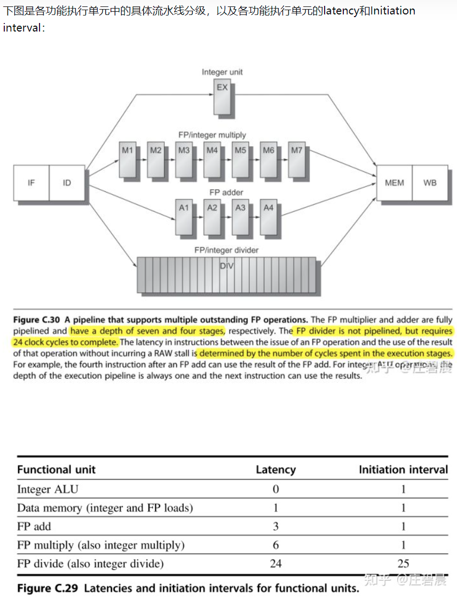
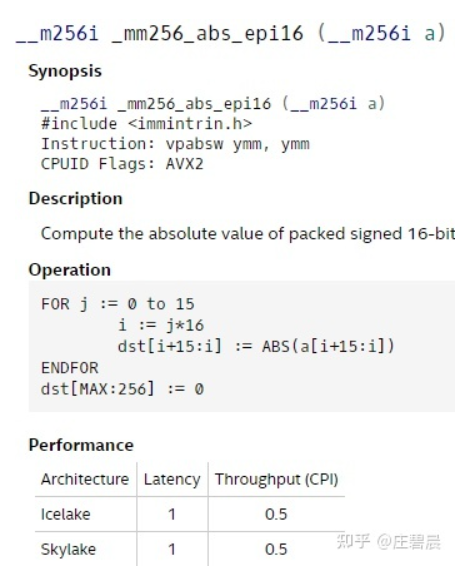

## **多功能单元流水线的延迟(Latency)、启动间隔(Initial interval)和吞吐量(Throughput(CPI))**

每个执行单元完成执行任务所需的时钟周期不同，因此执行单元中的流水线分级是不同的

参考《计算机体系结构——量化研究方法》

**延迟（Latency）：生成结果的指令与使用该结果的指令之间的周期数。**（在没有发生RAW**（读后写）**冒险的情况下）。关于latency我的理解是，该指令执行之后，需要等待多久该指令才能产生可以使用的结果，被其他指令所使用。举个例子，浮点加法单元的latency为3，意味着如果有一条浮点加法指令，那么在不发生RAW的情况下，最快也要在3个时钟周期后，其他指令才能使用刚才这条浮点加法指令的运算结果。

**启动间隔（Initial interval）：在发出两个给定类型的操作之间必须间隔的周期数。**关于Initiation interval我的理解是：**它有点像Throughput吞吐量**，也就是在发射了一条这样的指令后，需要多少个时钟周期才能够再次发射一条这样的指令。

**功能单元的latency等于执行流水线深度减去1个时钟周期**，也就是比如说浮点加法单元中有四级流水线，因此它的latency为4-1=3。而**功能单元的Initiation interval**与功能单元流水线中**最耗时的阶段有关**，且**与有多少个功能单元有关**。像图中的浮点加法单元使用了4级流水线，每个阶段需要花费1个时钟周期，所以每个时钟周期都可以发射一条浮点加法指令，两者间不会发生结构冒险。而像浮点除法单元，内部没有使用流水线，所以后一条浮点除法指令必须等到前一条浮点除法指令完全执行完，退出浮点出发单元，才可以开始执行，Initiation interval就是25个时钟周期。

**Intel Intrinsics**文档中提到的avx2向量指令的**两个属性latency和Throughput（CPI）：**

**指令的latency可以对应到功能单元的latency**，也就是完成一条指令所需要的时钟周期

**指令的Throughput（CPI）**意思是**发送一条指令**所需要的时钟周期数

0.5意味着一个时钟周期可以发射两条这样的指令，这与功能单元的Initiation interval定义是可以对应上的

**长延迟流水线可能会导致结构冒险和写后写（WAW）冒险**。WAW冒险产生的原因如下：浮点运算指令的latency较长，因此可能会出现**后面整形运算指令比前面的浮点运算指令先完成的情况，从而导致后面的写操作被前面的写操作所覆盖**，违背了代码的原意。这两种冒险在原来标准的5级流水线中是不可能出现的。因此需要使用特殊的技术来检测这些冒险。

 

总的来说，指令的latency与Throughput，与对应功能单元的流水线组成是密切相关的。从本文也可以看出，**在对程序进行调优时（尤其是使用Intel Intrinsics写avx向量化指令时），就特别需要注意指令流水的问题**。如果**将相同运算类型的指令排在一起执行，其实是有利于充分发挥功能单元中的流水的**，从而提高功能单元的执行效率的。而如果**指令的Throughput较大时**（比如上面正文所提到的浮点除法指令），**两条这种类型的指令之间就必须填充足够多的指令**，来掩盖这种指令较大的Throughput，而不是让流水线阻塞在这两条指令之间的等待。当然，填充这部分的工作，现在编译器的指令重排可能就已经实现了。如果**指令的Throughput较小**，（例如0.5），则应该**将两条这种类型的指令放在一起，使得在一个时钟周期内可以同时将他们发射出去执行**，提高利用率。

