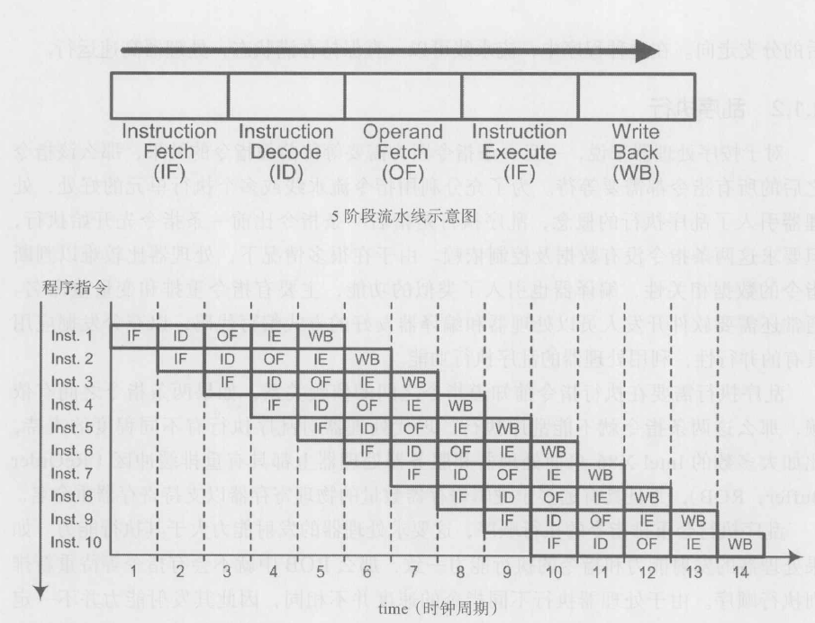
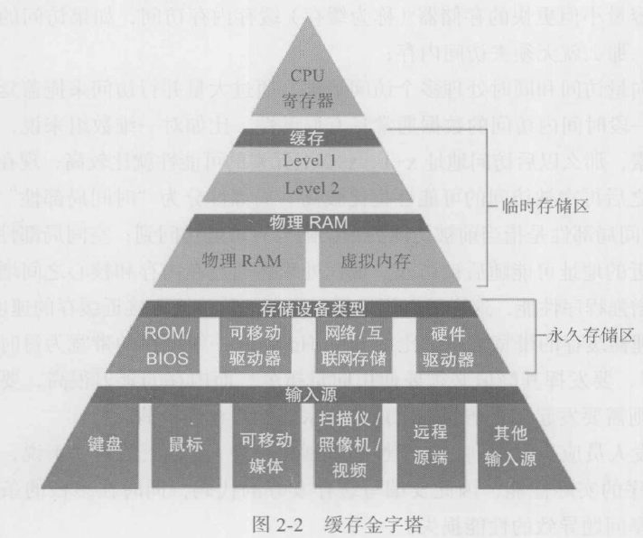
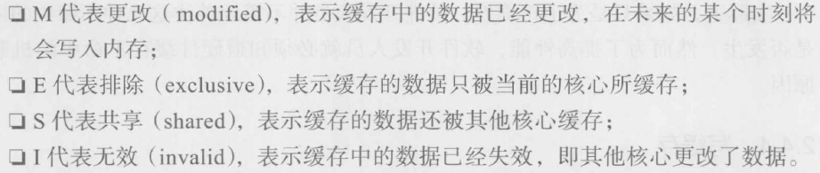
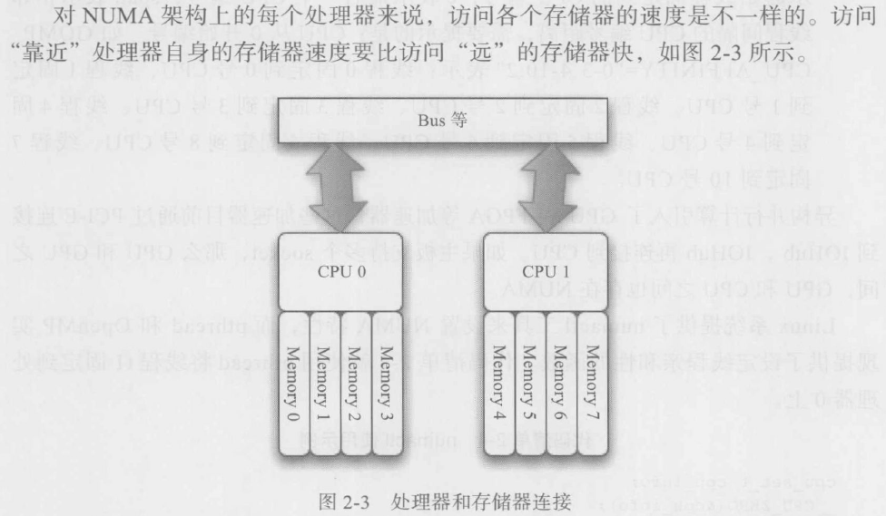

---

---

## 并行和向量化

减少延迟（更快完成计算任务）

提高吞吐量（在相同的时间内完成更多任务）

面向对象设计方法和向量化或并行冲突

**面向过程的设计方法加上以数据为中心完成向量化和并行程序**

分析面向对象软件中最耗时的代码(热点)，通过上述方式并行或向量化热点

- 任务/数据划分

  将多个工作划分成几小部分，每个控制流处理一个或多个部分。

  不均匀的划分导致负载不均衡。（**负载均衡**用于在控制流之间重新分配任务/数据）

  不成熟的划分导致各个控制流之间的通信开销过大。

  控制流对cpu资源的占用（缓存，虚拟存储器）

- 并发访问控制

  问题：多个控制流同时读取一个文件，有可能读取到错误数据

  两种解决方式：一个控制流读取文件，分发数据；将文件分成多个子文件，控制流分别读取子文件

  将访问分为读和写

- 资源划分（内存划分）

  资源划分与并发访问控制、通信(控制流之间的数据交换)密切相关

  伪共享问题，多出现在多核心编程时核心和缓存之间的组织

**优化标量串行程序通常应当在向量化或并行之前进行**

## 进程和线程

线程存在进程之中，进程中所有线程**共享进程的资源并独享某些资源，更易于线程之间的通信**

**进程**可调度到一台机器中的**一个或多个处理器核心**上执行，而**线程**会调度到**一个核心**上执行，**向量化**代码则会映射到**一个核心内**的**向量单元**上执行

MPI—分布式存储器编程模式，各节点有独立的存储器，基于**进程的消息传递**通信更适合

Pthread、OpenMP—共享存储器编程模式，多核等由于共享存储器，基于**线程**更合适


##### 上下文—保持进程运行所需要的寄存器、缓存和DRAM等资源

当前进程时间片到期，保存该进程的状态并切换到另一个进程的过程称为“**上下文切换**”（<font color = 'red'>获得了并发的特性</font>）

任何一个无限精度的时刻，一个处理器核心**最多**只能运行一个进程或一个线程

进程的**上下文切换和通信**比较**耗时**，基于进程的并发更适合大粒度的任务并行

进程是程序正在运行的状态，是资源拥有的独立单位，不同的进程拥有**不同的虚拟地址空间**，不能够直接访问其他进程的上下文资源

线程共享进程的上下文，如虚拟空间地址和文件，**独立执行**，可通过**存储器**进行**通信**

线程有私有**逻辑存储器、栈和<font color = 'red'>指令指针PC(Program Counter,PC)用来存放当前欲执行指令的地址</font>**


**基于GPU的并行编程**也使用基于线程的开发环境，是一种“硬件线程”，其线程的创建、调度和销毁开销接近0

**单核上的多线程**通过分时共享执行，使得一些**长延迟操作**不会导致核心空闲（锁、IO访问等）


##### 超线程

对于指令丰富且多的应用，性能提升显著（本质是通过增加一些PC和寄存器来减少线程切换代价）

能够在单个时针周期内在两个线程间切换，让单核能够使用线程级并行计算，减少了cpu的限制时间

可以在同一时间内使用芯片的不同功能单元，能够同时处理两个指令

但是**执行单元只有一个**


##### 阻塞和非阻塞

相对于进程或线程本身而言

非阻塞：一个操作不阻碍进程或线程，接着执行代码

非阻塞要求开发人员手动保证操作的完成，可能会带来数据一致性问题


##### 同步和异步

相对于通信的多个进程或线程

异步：当前线程或进程和其他线程或进程通信时，不需要其他线程做好准备


某些缓存或内存敏感的应用多线程或多进程的可扩展性并不理想，因为平均每个线程占用的缓存会变小

OpenMP和Pthread适合多核心的编程方式，但是容易产生**伪共享和负载均衡**等性能问题


## 现代处理器特性

乱序执行指令，同一时刻可存在多条指令同时执行

<font color = 'red'>**一些特性：**</font>

**指令级并行：流水线、多发射、VLIW、乱序执行、分支预测等**

**矢量化：SIMT、SIMD**

**线程级并行：多核支持的线程级并行**

**缓存层次结构：缓存组织、缓存特点以及NUMA（非均匀访问内存，核心访问离其近的内存延迟小）**</font>

### 指令级并行

要求同时执行的指令之间没有数据或控制依赖

**能够处理某些在编译阶段无法知道的相关关系（如涉及内存引用）**

**指令流水线**

同时利用处理器的不同功能单元

流水线执行允许在同一时钟周期内**重叠执行**多个指令

**经典五阶段流水线：**




超标量：每个时钟周期超过一条指令的吞吐量

**一条指令的计算和另一条指令的访存**，能够好地利用流水线

单条指令的延迟可能长达**几个或几十个**时钟周期

 

长流水线的处理器想要达到最佳性能，需要程序给出高度可预测的控制流：

代码主要在**紧凑循环**中执行的程序，可以提供恰当的控制流，比如**大型矩阵或者在向量中做算术计算**的程序


##### 乱序执行

后一条指令比前一条指令先执行，要求两条指令没有数据及控制依赖

**编译器层面：指令重排和变量重命名**

代码层面：以处理器和编译器友好方式编写代码

重排缓冲区（ROB）

X86具有远多于逻辑寄存器数量的物理寄存器以支持寄存器重命名

 

乱序执行要求处理器的发射能力大于其执行能力：处理器执行不同指令的速度并不相同，其发射能力并不一定比执行最快的指令的吞吐量达，比如X86一个周期能处理4条整数加法指令，但其指令发射能力也是一周期四条


##### 指令多发射


##### 分支预测

选择某条分支执行，一旦选择错误，处理器就要丢弃已经执行的结果，并从正确的分支开始执行

如果程序中带有**许多循环**，且**循环计数比较小**，或者**面向对象的程序中带有许多虚函数**的对象（每个对象都可以引用不同的虚函数实现），此时程序的控制流不可预测，处理器常常猜错


##### VLIW**（Very Long Instruction Word）**

在编译阶段确定并行调度，不再需要处理器的调度硬件


### 向量化并行

内置函数（Intrinsic）可接近或者达到手工使用汇编优化的性能

内置函数的本质是使用C函数指定向量化操作，使用向量指令加载数据

##### SIMD

<font color = 'red'>**要求熟悉指令的类型、吞吐量和延迟**</font>

<font color = 'red'>**不同的处理器对SIMD指令的支持程度不同，在不同的架构上会有不同的延迟和吞吐量表现**</font>

##### SIMT

GPU多线程


### 线程级并行

多线程——>多核心——>多流水线同时执行

##### 内核线程和用户线程

运行在用户空间（运行时）的线程被称为用户线程

运行在内核空间（操作系统）的线程被称为内核线程

 

用户线程由库管理，创建和调度无需干扰操作系统运行，开销少

内核线程由操作系统负责

 

操作系统不知道用户线程的存在，无法将其映射到核心上，当一个用户线程由于资源分配而阻塞时，操作系统无法切换

 

一个进程支持的线程数量有限（Linux下用sysconf函数查询，通常大于等于64）

 

现代库和操作系统可以把用户线程映射到内核线程：1对1，1对多，多对1，多对多

很多线程库都使用多对多，**实际在核心上执行的线程数量可能远少于声明或创建的线程数量**

Pthread是用户级线程库，但是linux使用了内核级线程实现（1对1），因此Pthread和GCC的openmp都是内核线程


##### 多线程编程库

Pthread

Win32 thread

Openmp

c/c++标准线程

opencl（**支持fpga**）和cuda

openacc（**支持fpga**）


##### 多核心多线程并行需注意

- 系统上的线程数量远超核心数量，会导致频繁上下文切换，降低性能（如缓存污染）
- 多个线程读写同一共享数据，产生竞争，需要**同步**，会潜在降低性能
- 死锁：所有线程都在互相等待其他线程释放资源
- 饿死：一个或多个线程永远没有机会调度到处理器上执行
- <font color = 'red'>伪共享</font>：多个线程读写的数据映射到同一条缓存线上时，有一个线程更改了数据，那么其他线程对该数据的缓存就要被失效，如果线程频繁地更改数据，硬件就需要不停更新缓存线，使得**<font color = 'red'>性能从独享缓存的水平降低到共享缓存或内存的水平</font>**


##### 多线程程序在单核和多核上运行的不同

锁：单核上，多线程执行锁或者临界区时，实际只有一个线程在执行，因此不存在冲突，影响的只是持有和释放锁的时间，处理器一直保持运行；多核上，锁或临界区会导致其余核空闲，只允许一个处理器执行有锁的线程，是一个**串行过程**，会影响性能

- 负载均衡：单核上无需考虑，即使各个线程任务极度不均衡，也不影响执行总时间；多核上，最终时间由运行时间最长的线程决定
- 任务调度：单核调度完全由操作系统管理；多核需要合理地在核心间分配任务，以尽量同时结束计算
- 程序终止：需判断各个线程都已计算完成


### 缓存

减少处理器吞吐与内存吞吐和延迟的差异产生的影响：

- 每次内存访问，读取周围多个数据
- 缓存存储数据
- 支持向量访问和同时处理多个访问请求，通过大量并行访问来掩盖延迟

时间局部性：当前被访问的数据随后有可能访问到

空间局部性：当前访问地址附近的地址可能随后被访问

**内存的延迟很高，要隐藏内存的高延迟，则需要发起多个访问请求让流水线始终在满负荷运行**


##### 缓存层次结构

缓存命中：一次访存操作，如果访问的数据在缓存中，则称为缓存命中

缓存命中率：程序执行过程中缓存命中的次数占总访存次数的百分比




##### 缓存一致性

缓存中的数据和内存中的数据一致

单核：某个地址上读得到的数据一定是最近的核写进去的，若某条指令改变了地址0x0100上的内容，那么核心对0x0100的缓存需要失效

多核：多个核心缓存了同一个内存地址的数据，若一个核心更改了该地址的数据，其他的核心就需要对该地址数据缓存失效

<font color = 'red'>MESI策略：</font>



多核系统缓存一致性并不代表多个控制流同时读写一个变量不会产生问题

伪共享本质上也是一种缓存一致性问题


##### 缓存不命中

冷不命中：程序开始执行时

满不命中：缓存被占满，请求的数据不在缓存中，需要将某个已缓存数据x覆盖为新请求的数据。如果随后又要请求x，那么x不命中。

冲突不命中：由于内存比缓存大得多，多个内存地址会被映射到同一个缓存地址。新读取的数据被放入缓存地址a，如果a中原始数据在随后被访问，则不会命中。


##### 写缓存

写入内存，还是写入下一层缓存

当要写的数据已经在缓存中时（**写命中**）：

- 写回（write back）：**仅当一个缓存线需要被替换回内存时（缓存已满，或者多线程时，其他线程需要访问这个数据），将数据写入内存或下一级缓存**。缓存线会有**脏位**，标识缓存线在被载入之后是否发生过更新，若被置换回内存之前从未被写入过，就不用写回内存。
- 写直达（write through）：每当缓存接收到写数据指令，都直接将数据写回到内存或下一级缓存。若此数据也在缓存中，则必须同时更新缓存。

以上两种方式，如果更新的地址被其他核心缓存，那么其他核心对此地址的缓存必须失效。

**写缓冲**：核上有一个缓冲区用于临时保存等待写回内存的数据。

只要写缓冲中的数据不在**随后**被访问或更新，那么写操作就可以**完全流水线化**。

但是某些写后读或写后写会导致<font color = 'red'>**串行化问题**（读时必须等待前面的写操作完成）</font>

如下例：需要检查写缓冲的前缀和代码

```c
for(int i = 0; i < n; i++)
{
    a[i + 1] += a[i];
}
/**
下一次循环需要使用前一次循环写入的数据，因此硬件必须检查写缓冲中的操作是否完成，
导致延迟增加，不能完全流水线化
*/
```

```c
// 改写成如下代码
tmp = a[0];
for (int i = 0; i < n; i++)
{
    tmp += a[i];
    a[i] = tmp;
}
```

**写不命中**：需要被写的数据不在缓存中

写分配：在缓存中分配一条缓存线。如果被写入的**数据局部性很好（在随后会被读）**，那么写分配就合适

写不分配：直接写入内存，适合写入的**数据局部性很差的情况（在随后不会被再次使用）**


##### 越过缓存

当某个数据只被访问一次，其后其相邻的数据会被访问，但其本身不会被再次访问，则该代码**只具有空间局部性而没有时间局部性**。能够将缓存留给需要缓存的数据访问。

流加载和流存储：如simd的stream_load，stream_store


##### 硬件预取（Prefetch）

程序访问数据能很好地满足局部性需求，预取就能提高性能，反之则会降低性能。

如SSE的prefetch指令


##### 缓存结构

以**缓存线为基本单位**读写

每条缓存线可以保存L（L一般为**64字节**）

缓存间的数据移动以缓存线为单位，开发时需关注**缓存的总量**和**缓存线的大小**

**内存容量越大，访问延迟越长**，需要更大层次更多的缓存弥补

 

**缓存线**：每次读写一个或多个缓存线，不存在半个（<font color = 'red'>不包括寄存器从一级缓存读</font>）

长度是2的幂次，CPU通常为64B，GPU为128B

缓存线会映射到连续的地址，读取数据时，能**对齐到缓存线长度**，可以有效减少访存次数

缓存总量一定，缓存线长度增加会增加访问延迟，但是有可能会减少访存次数提高带宽

多个映射到同一个缓存的内存地址，读取时可能会造成存储器访问“抖动”（冲突不命中）

**缓存组**：多个缓存线组成一组，每个对齐到缓存线的内存地址可映射到一组中的某一条缓存线。**组大小通常为8或16条缓存线（512B或1KB）**。

缓存容量固定且缓存线大小固定，如果增加缓存组内缓存线的数量，那么缓存组数量就会减少，<font color = 'red'>出现满不命中的可能性越大</font>。


##### 映射策略

缓存被占满时，哪些内容要被替换、从下一级缓存取出的数据要放到上一级缓存的什么地方

组相连：缓存组中的缓存线数量大于1，一个内存地址可映射到缓存组中的多条缓存线

直接相连：每个缓存组只存在一条缓存线

全相连：所有缓存线都属于同一个组

以X86一级缓存为例（旧）：

32KB一缓，缓存线长度为64B，每个缓存组8条线，共64组

64*64=4KB的数据会映射到同一组（同一组8条线映射同以内存地址）


##### 虚拟存储器和TLB<font color = 'red'>（涉及分页机制）</font>

虚拟存储器是对内存和IO设备（包括硬盘）的抽象，通过将内存中的数据切换到硬盘，使得进程好像拥有了比整个内存容量大得多的内存空间。

具体的物理地址有映射机制决定

虚拟存储器使用虚拟地址寻址，物理存储器使用物理地址寻址

硬件执行访存操作需要将虚拟地址翻译成物理地址，操作系统和存储器管理单元（MMU）配合完成该操作，该转换非常耗时，有两个优化方式可以减少转换次数


##### 分页机制

虚拟存储器和物理存储器被划分为大小相等的页，两者交换以页为单位

页大小4KB、64KB或4MB，远大于缓存线大小


##### TLB

用于缓存已经翻译的虚拟地址，通过利用访问页的局部性来减少翻译次数

一些需要对多维数据进行访问的程序在大数据量的情况下，通常存在**TLB不命中的情况**

解决不命中的方法：

- 增加页的大小
- 对于重复多次使用且局部性很好的多维数据，临时分配数据空间来保存数据的一部分，然后重复使用该临时数据空间，此时TLB只需要保存这一部分临时数据空间的地址即可
- 数据分块优化，如果数据被多次使用，且太大，则进行分块保证其大小能够TLB缓存命中


##### NUMA技术



控制流分配存储器时要保证分配的存储器离自身所在的处理器比较“近”：

- 分配存储器时分配在离自己近的物理内存上，线程内使用malloc

  ```c
  #pragma omp parallel
  {
  	int myid = omp_get_thread_num()’
  	data[i] = (*float)malloc(size);
  	init(data[i]);
  }
  ```

  

- 控制流不能在核心间迁移（单线程程序保证在一个核心上执行）

  设置**线程亲和性**

  **<font color = 'red'>gcc环境变量GOMP_CPU_AFFINITY</font>**，使用（s-e:span）格式

  s-起始线程固定到的CPU编号，e-最后一个CPU编号，span-相邻线程间隔的CPU编号距离

  例：GOMP_CPU_AFFINITY = “0-3 4-10:2”

  线程0 : CPU0; 线程1 : CPU1; 线程2 : CPU2; 线程3 : CPU3; 线程4 : CPU4; 

  线程5 : CPU6; 线程6 : CPU8; 线程7 : CPU10

  Linux提供了numactl工具来设置NUMA特性

  [Linux工具之numactl_qccz123456的博客-CSDN博客_numactl](https://blog.csdn.net/qccz123456/article/details/81979819)

  

  Openmp和pthread都有设置亲和性函数

  例：

  ```c
  cpu_set_t cpu_info;
  __CPU_ZERO(&cpu_info);
  __CPU_SET(0, &cpu_info);
  if (0 != pthread_setaffinity_np(t1, sizeof(cpu_set_t), &cpu_info))
  {
  	printf(“set affinity failed”);
  }
  /**
  * cpu_set_t是一个掩码向量（1024位），每一位对应一个cpu核心
  * __CPU_ZERO宏将掩码向量cpu_set_t清零，__CPU_SET宏将掩码向量的某一位设置为1
  * 上述例子就将线程t1绑定到cpu0上
  */
  ```

  

## 算法性能和程序性能的度量和分析


### 算法分析的性能度量标准

### 程序和指令的性能度量标准

### 程序性能优化的度量标准

### 程序性能分析工具

goprof

 

valgrind

 

vampire和vampireTrace

 

Intel VTune

 

perf

### 串行代码性能优化


