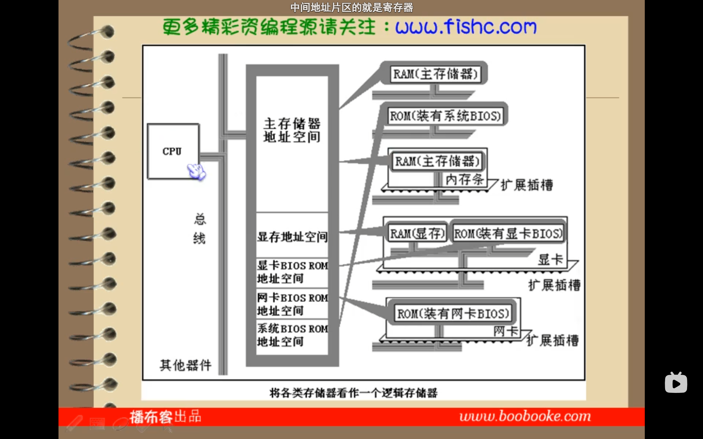

## 基础知识

```assembly
mov AX, BX  ;;; 将寄存器BX的内容送到AX中
```

寄存器：cpu内部的存储器(内部的内存)。

### 汇编语言的组成

#### 汇编指令（机器码的助记符）

```assembly
mov AX, BX  ;;; 将寄存器BX的内容送到AX中
```


<font color = 'red'>伪指令和其他符号计算机都无法识别，通过编译器进行转换</font>

#### 伪指令（由编译器执行）

#### 其他符号（由编译器识别）

### 指令和数据

指令和数据是应用上的概念

在内存或硬盘上，指令和数据没有任何区别，都是二进制信息

二进制信息：

1000 1001 1101 1000  ——> 89D8H (数据)

​										——> mov AX, BX (指令)

### 存储单元

存储器被划分为若干个存储单元，每个存储单元从0开始顺序编号

例：

一个存储器有128个存储单元，编号为0-127，低地址在最上面，高地址在最下面

### CPU对存储器的读写

三类信息交互：

- 存储单元的地址（地址信息）
- 器件的选择，读或写命令（控制信息）
- 读或写的数据（数据信息）

在计算机中专门有链接cpu和其他芯片的导线，称为**总线**：

- 物理上：导线的集合
- 逻辑上：
  - 地址总线：cpu通过地址总线来指定存储单元。地址总线上能传送多少个不同的信息，cpu就可以对多少个存储单元进行寻址。**一个cpu有N根地址总线，则可以说这个cpu的地址总线的宽度为N**，则CPU最多可以寻找**2的N次方个内存单元**。一根地址总线可以索引一个内存单元，即可以索引**一个字节**。
  - 数据总线：数据总线的宽度决定了cpu和外界(内存及其他器件)的数据传送速度。
  - 控制总线：控制总线是一些不同控制线的集合。有多少根控制总线，就意味着cpu提供了对外部器件的多少种控制。

**每一种CPU都有自己的汇编指令集（如SIMD）**

#### 各类存储器芯片

从功能和连接上分类：

- 随机存储器RAM
- 装有BIOS的ROM
- 接口上的RAM

### 内存地址空间

若一个cpu的地址线宽度为10，那么可以寻址1024个内存单元，则这1024个可寻的内存单元构成了这个cpu的内存地址空间

将各类存储器看作一个逻辑存储器：

- 所有的物理存储器被看作一个由若干存储单元组成的逻辑存储器
- 每个物理存储器在这个逻辑存储器中占有一个地址段，即一段地址空间
- cpu在这段地址空间中读写数据，实际就是在相应的物理存储器中读写数据



## 寄存器-CPU工作原理

一个典型的cpu由**运算器、控制器和寄存器**等器件组成，这些器件靠内部总线相连

**通用寄存器：**AX、BX、CX、DX

寄存器高位和低位，XH和XL

### 字在寄存器中的存储

一个字由两个字节组成，分为高位字节和低位字节。一个字可以存在一个16位寄存器中。

### 几条汇编指令

在写一条汇编指令或一个寄存器的名称时不区分大小写。如：MOV AX, 18 和 mov ax, 18 的含义相同；bx和BX含义相同
